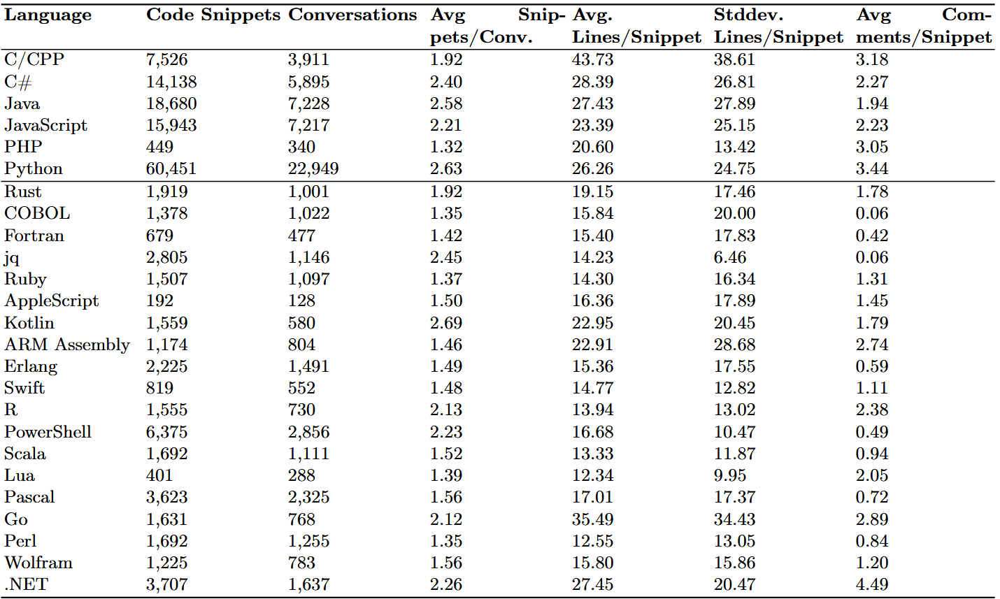

# WildCode



## Links and Authors

*   **Paper:** [Link to Paper](YOUR_PAPER_LINK_HERE)
*   **Hugging Face Dataset:** [WildCode on Hugging Face](https://huggingface.co/datasets/regularpooria/wildcode)
*   **GitHub Repository:** [WildCode on GitHub](https://github.com/regularpooria/wildcode)

### Authors
*   Kobra Khanmohammadi (Sheridan College, Ontario, Canada) - kobra.khanmohammadi@sheridancollge.ca
*   Pooria Roy (School of Computing, Queen's University, Kingston, Canada) - pooria.roy@queensu.ca
*   Raphael Khoury (Université du Québec en Outaouais (UQO), Canada) - raphael.khoury@uqo.ca
*   Wahab Hamou-Lhadj (Concordia University, Montreal, Canada) - wahab.hamou-lhadj@concordia.ca
*   Wilfried Patrick Konan (Université du Québec en Outaouais (UQO), Canada) - konk14@uqo.ca

## Setting up the GitHub repository
1. Clone this repository
   ```bash
   git clone https://github.com/regularpooria/wildcode
   ```
2. Clone the submodules with a depth of 1
   ```bash
   git submodule update --init --recursive --depth 1
   ```
3. Setup a Python virtual environment with the `virtualenv` package (installation and making "venv")
   ```bash
   pip install virtualenv
   virtualenv venv
   source venv/bin/activate
   ```
4. Install the packages from `requirements.txt`
   ```bash
   pip install -r requirements.txt
   ```
5. Some linting and analysis tools are needed for certain experiments, which in those cases the installation process is explained and performed in the notebook itself.
6. The development of this repository has been done on a Linux device (WSL). As a result, some of the commands in the notebooks are exclusively for Linux and will not run on a Windows device.

## Generating the dataset from WildChat:

Follow these files in sequence:
1. `experiments/code_snippets/Extract_codesnippets_from_wildchat.ipynb`
	1.1 This file will load the WildChat-1M dataset and extract any code snippet that starts and ends with 3 backticks "```"
	1.2 It will save any code snippets that it finds into a json file called `tmp/code_snippets.json`. Each code snippet will have a "conversation_hash" that corresponds to the conversation in WildChat-1M dataset and the code itself alongside with the given programming language name in the backtick.
2. `experiments/code_snippets/Classify_programming_language.ipynb`
	2.1 This file will load the `tmp/code_snippets.json` and will pick out any code snippet that does not have a language name assigned to it (90k rows).
	2.2 At the end, the predicted languages will get replaced in `tmp/code_snippets.json`
3. `experiments/code_snippets/run_linting.ipynb`
	3.1 To ensure that we have clean code in Python, C/CPP, C#, Java, JavaScript, PHP we have to use their respective linting/compiler tools to weed out any bad syntax code snippets.
	3.2 This file will also use `tmp/code_snippets.json` to perform the syntax on any of the languages mentioned above.
4. `experiments/code_snippets/remove_bad_lints.ipynb`
	4.1 This notebook will iterate through each linting result and remove them from the temporary dataset.
	4.2 At this point, the dataset generation is done, and for our paper we split `tmp/code_snippets.json` into individual json files by language and updated it to Hugging Face and called it WildCode.

## Step 2: Hallucinations on WildCode
1. `experiments/hallucinations/javascript_hallucinations.ipynb`
	1.1 This notebook will load the WildCode dataset and extract the used libraries in JavaScript/NodeJS code snippets.
	1.2 The list of libraries will then be checked using the "all-the-package-names" package from NPM that has a list of ALL npm packages and is updated regularly. If the libraries exist then they will be excluded from the list.
	1.3 The list of libraries will then be checked against the built-in modules in NodeJS and removed from the list.
	1.4 The results will be written to `results/hallucinations_javascript.json` at the end. This file may include actual libraries that exist and we tackle this problem in `experiments/hallucinations/verify_hallucinations.ipynb`

2. `experiments/hallucinations/python_hallucinations.ipynb`
	2.1 This notebook performs the same library extraction as step 1.1 for Python code snippets.
	2.2 Similar to step 1.2, but for Python, we use the `utils/simple` file which contains a list of all PyPI packages at the time of writing this README. A newer version can be found by querying PyPI.
	2.3 Similar to step 1.3, this step checks against built-in Python modules.
	2.4 The results will be written to `results/hallucinations_python.json`.

3. `experiments/hallucinations/verify_hallucinations.ipynb`
	3.1 This notebook will read the list of hallucinations from either Python or JavaScript and then asks an LLM to search the web and determine if the given library name is hallucinated or legitimate.
	3.2 For the LLM, you will need to use OpenRouter and provide your own API key.
	3.3 This will create a new file `results/hallucinations_LANGUAGE_cleaned_with_ai.json` (where LANGUAGE is either `javascript` or `python`).

## Step 3: Security analysis
1. `experiments/security_analysis/run_statnt_analysis_tool.ipynb`
	1.1 This notebook uses `opengrep` and `opengrep-rules` to perform vulnerability checks on the WildCode dataset.
	1.2 The output will be saved to `.sarif` files for each language and will also be saved into `.csv` files in the `results` folder. These will later be used to target more specific issues such as weak hash algorithms, SQL injection, etc.
2. `experiments/security_analysis/parse_results.ipynb` (for `deserialization`, `hash`, `unsafe_memory`, `weak_random`)
	2.1 These notebooks look through the static analysis tool results and return the conversation hashes that are affected by these issues, alongside with some statistics that we used in the paper.