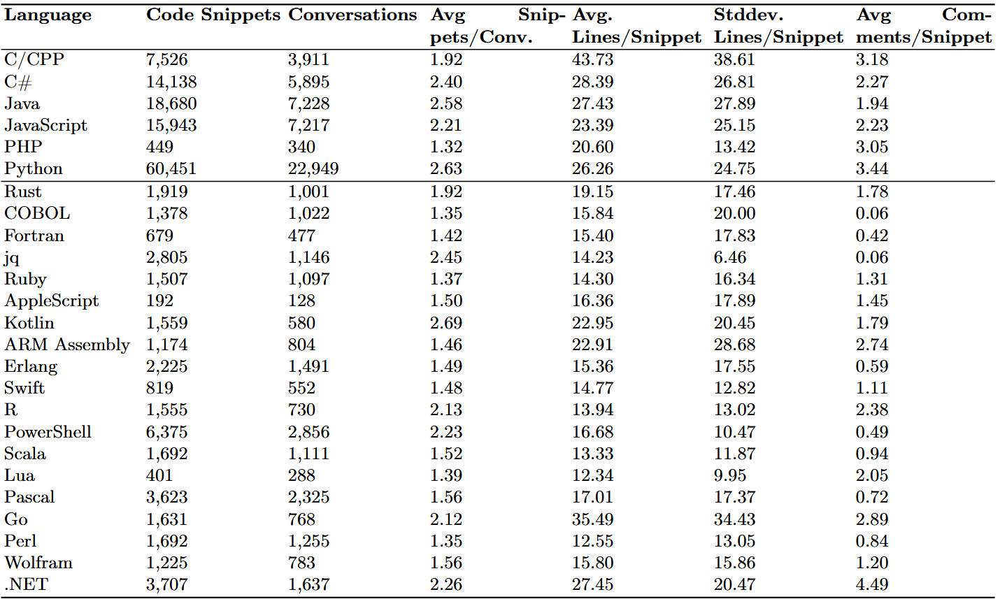

---
language:
  - "en"
pretty_name: "WildCode"
tags:
  - "code"
  - "programming"
license: "cc-by-4.0"
task_categories:
  - "text-generation"
  - "text-ranking"
  - "other"
---
# WildCode

WildCode is a curated dataset of **real-world conversations containing code snippets**, derived from the [WildChat-1M dataset](https://huggingface.co/datasets/allenai/WildChat-1M) ([Zhang et al., 2024](https://arxiv.org/abs/2405.01470)).  
While WildChat captures a broad distribution of human–LLM conversations “in the wild,” WildCode focuses specifically on the **programming and code-related subset**, making it more suitable for code modeling, retrieval, and conversational coding research.

---

## Source

- **Base dataset**: [WildChat-1M](https://huggingface.co/datasets/allenai/WildChat-1M)  
- **Reference**:  
  *Zhang, M., Zheng, Z., Liu, S., Lee, D., Zhao, J., Wang, Y., Wang, Y., Zhong, V., & Yih, W. (2024).*  
  ["WildChat: 1M ChatGPT Interaction Logs in the Wild"](https://arxiv.org/abs/2405.01470).  

---

## How WildCode Was Generated

1. **Extraction**: Filtered WildChat conversations to only those containing **programming code snippets** across multiple languages.  
2. **Normalization**: Cleaned code blocks to remove malformed formatting, incomplete markdown fences, and obvious artifacts.  
3. **Classification**: Automatically labeled each snippet with its most likely programming language using a lightweight classifier.  
4. **Statistics**: Computed per-language statistics, including:
   - number of snippets  
   - number of conversations containing snippets  
   - average snippets per conversation  
   - average and std. deviation of lines per snippet  
   - average number of comments per snippet  

This results in **WildCode**, a structured dataset that makes it easier to benchmark and explore code-related LLM behavior in real-world settings.

---

## Code Statistics

<p align="center">
  
</p>

---

## Links and Authors

*   **Paper:** [Link to Paper](YOUR_PAPER_LINK_HERE)
*   **Hugging Face Dataset:** [WildCode on Hugging Face](https://huggingface.co/datasets/regularpooria/wildcode)
*   **GitHub Repository:** [WildCode on GitHub](https://github.com/regularpooria/wildcode)

### Authors
*   Kobra Khanmohammadi (Sheridan College, Ontario, Canada) - kobra.khanmohammadi@sheridancollge.ca
*   Pooria Roy (School of Computing, Queen's University, Kingston, Canada) - pooria.roy@queensu.ca
*   Raphael Khoury (Université du Québec en Outaouais (UQO), Canada) - raphael.khoury@uqo.ca
*   Wahab Hamou-Lhadj (Concordia University, Montreal, Canada) - wahab.hamou-lhadj@concordia.ca
*   Wilfried Patrick Konan (Université du Québec en Outaouais (UQO), Canada) - konk14@uqo.ca

---

## Citation

If you use **WildCode** in your research, please cite the original WildChat paper and this dataset:

```bibtex
@inproceedings{zhang2024wildchat,
  title={WildChat: 1 Million Conversations In-the-Wild with LLMs},
  author={Zhang, Michael and Zheng, Ziqiao and Liu, Shizhe and Lee, Dongyoung and Zhao, Jing and Wang, Yizhou and Wang, Yuxuan and Zhong, Victor and Yih, Wen-tau},
  booktitle={arXiv preprint arXiv:2405.01470},
  year={2024}
}

@misc{wildcode2025,
  title = {WildCode},
  author = {Your Name},
  year = {2025},
  howpublished = {\url{https://huggingface.co/datasets/**regularpooria**/WildCode}}
}
